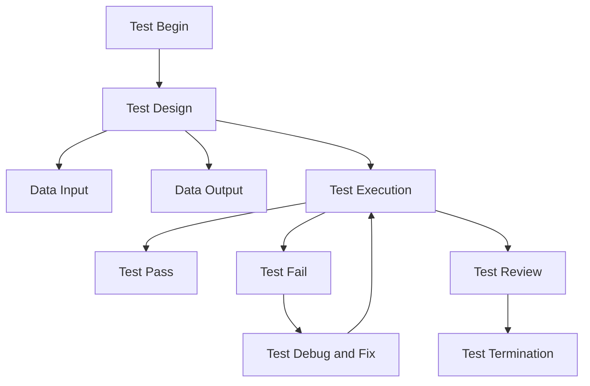

# Exploring Python Testing Frameworks: A Comprehensive Review

This repository has been created to assess the performance, usability, and maintenance aspects of frameworks specifically designed for Python language testing.
Within this README, you will find a brief explanation for each available framework, along with an example for each.

These frameworks are sort in terms of usability and popularity, each of them contains three files:

`install.sh`: this bash facilitates installation for each framework with pip3

`run.sh`: this bash is aimed to run the example by typing ./run.sh (before grant execution permissions)

`output.log`: saves the output (stdout and stderr) of executing 'run.sh' (it already has an example, note that some frameworks don't have output when all test are ok)

## Observations
*** unittest is the primary unit testing framework in Python, and it is available in Python versions 2.7 and later. unittest2 serves as a compatibility layer for users of Python 2.4-2.6 who want to access some of the features available in the standard unittest module introduced in Python 2.7.

**While both nose and nose2 serve similar purposes and share some common features, nose2 is a more modern and actively maintained framework. If you are starting a new project or working with Python 3 and later versions, nose2 is likely a better choice. However, if you have an existing project that relies on nose, it may be more practical to continue using nose for backward compatibility

## Framework Feature Comparison: A Detailed Analysis

Creating a comprehensive comparison table for testing frameworks can be quite extensive, as there are numerous testing frameworks with different features and capabilities. However, this place provides several comparison tables for some popular testing frameworks in Python. Keep in mind that these table provides a basic overview and may not cover all aspects of each framework. Features and capabilities can vary over time as frameworks evolve.

| Framework           | Type              | Ease of Use      | Test Discovery | Fixture Support | Parameterized Tests | Mocking Capabilities |  Date first release |
|---------------------|-------------------|------------------|-----------------|-----------------|----------------------|-----------------------|-----------------------|
| `pytest`            | Unit Testing      | Easy             | Yes             | Yes             | Yes                  | Yes                   | 2004                  |
| `unittest (a.k.a. pyunit)`          | Unit Testing      | Medium           | Yes             | Yes             | Limited              | Limited               | 2001                  |
| `unittest2`         | Unit Testing      | Medium           | Yes             | Yes             | Limited              | Limited               | 2019                  |
| `testify`           | Unit Testing      | Medium           | Yes             | No              | Limited              | Limited               | 2010                  |
| `nose`              | Unit Testing      | Easy             | Yes             | Yes             | Yes                  | Limited               | 2005                  |
| `nose2`             | Unit Testing      | Medium           | Yes             | Yes             | Yes                  | Limited               | 2013                  |
| `doctest`           | Docstring Testing | Easy             | Yes             | No              | No                   | Limited               | 1997                  | 
| `Hypothesis`        | Property-based    | Medium           | Yes             | No              | Yes                  | No                    | 2016                  | 
| `tox`               | Test Automation   | Medium           | Yes             | Yes             | No                   | No                    | 2013                  |
| `Behave`            | BDD               | Medium           | Yes             | Yes             | No                   | No                    | 2010                  |
| `Robot Framework`   | BDD               | Medium           | Yes             | Yes             | No                   | No                    | 2008                  |
| `playwright`        | BDD               | Medium           | Yes             | Yes             | Yes                  | Yes                   | 2020                  |
| `Lettuce`           | BDD               | NA           | NA             | Na             | NA                  | NA                   | NA                  |

Note:
- "Type" indicates the type of testing the framework is primarily designed for (e.g., unit testing, property-based testing, BDD).
- "Ease of Use" is a general indication of how user-friendly the framework is.
- "Test Discovery" refers to the framework's ability to automatically discover and run test cases.
- "Fixture Support" relates to the framework's support for setup and teardown fixtures for tests.
- "Parameterized Tests" indicates whether the framework supports running tests with different input parameters.
- "Mocking Capabilities" assesses the framework's support for mocking and stubbing during testing.
- "BDD Support" shows whether the framework is designed for Behavior-Driven Development (BDD).

The table previously shown provides a simplified comparison. 

### Comparison of most popular frameworks:

| Feature                               | `unittest`                 | `pytest`                    | `nose`                     |
|---------------------------------------|-----------------------------|-----------------------------|-----------------------------|
| Test Discovery                        | Limited (manual test discovery) | Automatic test discovery   | Automatic test discovery   |
| Test Organization                     | Class-based test cases       | Function-based test cases  | Function-based test cases  |
| Assertions                            | Basic assertions             | Rich set of built-in and custom assertions | Basic assertions   |
| Fixture Support                       | Basic test setup/teardown methods | Powerful fixtures and plugins | Basic test |

### Description of some popular frameworks:

| Framework            | Description                                                                 | Key Features                           | Popularity                                   |
|----------------------|-----------------------------------------------------------------------------|----------------------------------------|---------------------------------------------|
| unittest (Built-in)  | Part of the Python Standard Library, inspired by Java's JUnit.             | Test discovery, test fixtures, test discovery, test parametrization.   | Widely used, but often considered verbose.   |
| pytest               | A third-party framework that simplifies testing and is highly extensible. | Concise test code, fixtures, plugins, parametrization, advanced features. | Extremely popular, large community.        |
| nose                 | An older, third-party framework with test discovery and test running.     | Test discovery, plugins, test attributes, better test discovery.        | Less popular in recent years.               |
| doctest              | Part of the Python Standard Library, allows embedding tests in docstrings. | Simple test setup, minimalistic.                                      | Useful for documentation testing.           |
| nose2                | An improved version of the `nose` framework.                               | Test discovery, test attributes, plugins, parallel test execution.   | Gaining popularity, but less known.         |
| Robot Framework      | A generic open-source automation framework for acceptance testing.       | Keyword-driven testing, test data-driven, easy-to-read test cases.   | Primarily used for acceptance testing.       |
| Hypothesis           | A property-based testing framework that generates test data automatically. | Automatically generates test cases, wide test coverage, complex test scenarios. | Gaining popularity in property-based testing. |

### Framework Foresight: Exploring the Advantages and Drawbacks

Certainly, here are the advantages and disadvantages of several popular Python testing frameworks and tools:

| Framework Name | Advantages              | Disadvantages |
|-----------------|----------------------|----------------------|
| `unittest`     |    - Built-in to Python's Standard Library.  - Supports test discovery.  - Offers test fixtures for setup and teardown.  |- Often considered verbose, leading to more code.  - Less concise syntax compared to other frameworks.    - Limited advanced features compared to some third-party frameworks.|
| `unittest2`     | - Provides some advanced features and bug fixes over the original `unittest` in Python 2.      |   - No longer necessary or maintained in Python 3 and above.|
| `pytest`       |  - Concise and readable test code.   - Rich ecosystem of plugins for extending functionality.   - Powerful fixtures system for better test organization.   - Advanced features like parameterized testing.|  - Requires installation as it's not part of the Python Standard Library.  - Learning curve for advanced features, but it's worth it for complex testing.  |
| `nose`         |   - Supports test discovery and test running.    - Allows the use of test attributes and offers better test discovery.  - Extensible through various plugins.             | - Less popular and maintained compared to `pytest`.    - Limited features for advanced testing.    - Somewhat dated and less extensible.|
| `nose2`        |   - An improved version of `nose` with better test discovery.    - Supports test attributes and offers plugins.   - Provides support for parallel test execution.        |   - Less popular compared to `pytest`.    - Still less known in the testing community.    - Less extensible and feature-rich than `pytest`.|
| `doctest`      |   - Part of the Python Standard Library, so no need for additional installation.     - Allows embedding tests within documentation, making it great for documentation testing.    - Offers simple test setup.      |   - Limited to testing docstrings.   - May not be suitable for complex test scenarios.    - Less flexible compared to other frameworks.|
| `Behave`       |   - A Python implementation of the Gherkin language, making it suitable for behavior-driven development.    - Easy to write human-readable test cases in plain text.      |   - Primarily designed for behavior-driven testing, not low-level unit testing.    - May require additional libraries for integration with specific frameworks.
| `Robot Framework` |  - Keyword-driven testing approach for easier test case design.    - Support for acceptance testing and integration with Selenium for web testing.    - High-level test cases are easy to read and write.|  - Primarily used for acceptance and end-to-end testing, not low-level unit testing.    - May require additional libraries for specific test cases.|
| `tox`          |   - Provides a way to manage and automate the testing of different Python environments.   - Useful for ensuring cross-version and cross-environment compatibility.          |   - May require additional configuration for specific project needs.   - Not a testing framework itself but a tool for test automation.
| `Testify`      |  - A lightweight testing framework that supports test discovery.  - Offers fixtures and simple test case definitions. |  - Less feature-rich compared to some other frameworks like `pytest`.    - Smaller community and less extensibility.
| `Hypothesis`   |  - Enables property-based testing, which automatically generates a wide range of test cases.    - Helps discover edge cases and uncover unexpected issues.    - Can generate complex test data for unbiased testing.        |   - Requires an understanding of property-based testing concepts.   - May not be suitable for all types of testing.    - Learning curve for those new to property-based testing.|
| `Playwright`   |  - Offers a Python library for end-to-end testing of web applications.    - Supports multiple browsers.    - Provides capabilities for automating web interactions. |   - Primarily designed for web application testing, not low-level unit testing.   - Requires web application setup and access to a browser.|

Please keep in mind that `doctest` is primarily designed for testing code examples embedded within docstrings, while `Robot Framework` is predominantly employed for acceptance testing purposes.

Licenses of each framework

| Framework Name | License              |
|-----------------|----------------------|
| `unittest`     | Python License       |
| `unittest2`     | Python License       |
| `pytest`       | MIT License          |
| `nose`         | GNU LGPL              |
| `nose2`        | GNU LGPL              |
| `doctest`      | Python License       |
| `Behave`       | MIT License          |
| `Robot Framework` | Apache License 2.0 |
| `tox`          | MIT License          |
| `Testify`      | Apache License 2.0 |
| `Hypothesis`   | MIT License          |
| `Playwright`   | Apache License 2.0 |

URL of each frameaork

Here's a table of popular testing frameworks in Python, along with their respective official links:

| Framework Name   | Official Link                                        |
|------------------|-----------------------------------------------------|
| `unittest`       | [Official `unittest` Documentation](https://docs.python.org/3/library/unittest.html) |
| `unittest2`       | [Official `unittest` Documentation](https://pypi.org/project/unittest2/) |
| `pytest`         | [Official `pytest` Documentation](https://docs.pytest.org/en/latest/) |
| `nose`           | [Official `nose` Documentation](https://nose.readthedocs.io/en/latest/) |
| `nose2`          | [Official `nose2` Repository](https://github.com/nose-devs/nose2) |
| `doctest`        | [Official `doctest` Documentation](https://docs.python.org/3/library/doctest.html) |
| `Behave`         | [Official Behave Documentation](https://behave.readthedocs.io/en/latest/index.html) |
| `Robot Framework` | [Official Robot Framework Website](https://robotframework.org/) |
| `tox`            | [Official `tox` Documentation](https://tox.readthedocs.io/en/latest/) |
| `Testify`        | [Official Testify Repository](https://github.com/Yelp/Testify) |
| `Hypothesis`     | [Official Hypothesis Documentation](https://hypothesis.readthedocs.io/en/latest/) |
| `Playwright`     | [Official Playwright Documentation](https://playwright.dev/python/docs/intro) |

Please note that the provided links lead to the official documentation or repositories for each testing framework. You can find detailed information, documentation, and resources at these links.

## Some Assitional Suggestions

* AI-Enhanced Static Code Analysis
  * DeepCode
  * Kite
* Mutation Testing 
  * MutPy
  * Pitest
* AI-Based Code Review
  * CodeClimate
  * DeepCode
## Other Frameworks of Python used in Test Automation
* UI automation
  * selenium webdriver
  * Toolium
  * webdriver_manager
  * gauge
  * splinter
  * Mailosaur
  * wtframework
  * Needle
  * PyPOM
  * pypom_form
  * Golem
  * Pylenium.io

## Taxonomy of Testing
* Unit Testing Frameworks: Unit testing is a fundamental aspect of software testing, verifying individual units or components of code to ensure they work as intended. 
  * pytest
  * unittest
* Functional Testing Frameworks: Functional testing involves testing the functionality and behavior of an application as a whole, simulating user interactions, and validating expected outcomes.
  * Selenium
  * testRigor
  * Robot Framework
* Integration Testing Frameworks: Integration testing involves testing the interaction and communication between different components or modules of an application.
  * PyTest-BDD

## References:

https://www.thoughtworks.com/radar

https://www.softwaretestinghelp.com/python-testing-frameworks/

https://www.browserstack.com/guide/top-python-testing-frameworks

https://www.testgrid.io/blog/python-testing-framework/

https://svitla.com/blog/testing-frameworks-for-python

https://www.learnenough.com/blog/python-unit-testing-frameworks

https://testautomationtools.dev/top-5-python-testing-frameworks/

https://www.lambdatest.com/blog/top-python-testing-frameworks/

https://medium.com/@arnabroyy/best-python-testing-frameworks-bb7ab1b3d366

https://www.testscenario.com/python-testing-frameworks/

<!--stackedit_data:
eyJoaXN0b3J5IjpbLTEyMzc1MTc5OSw3NzE4ODA2MTMsLTEyMT
IzMzEwMDldfQ==
-->

graph LR
  linkStyle default fill:#ffffff

  subgraph diagram[True North Services diagram]
    style diagram fill:#ffffff,stroke:#ffffff

    idEndUser["fa:fa-user
End User

[Person]
"]
    style idEndUser fill:#08427b,stroke:#052e56,color:#ffffff

    subgraph CSP
        idFrontend("
Frontend

[OJET]
")
        style idFrontend fill:#1168bd,stroke:#0b4884,color:#ffffff

        idBFF("
Backend-for-Frontend (BFF)

[Apollo GraphQL (JS)]
")
        style idBFF fill:#1168bd,stroke:#0b4884,color:#ffffff

        idCSPIdentity("
Identity

[<mark>TODO</mark>]
")
        style idCSPIdentity fill:#1168bd,stroke:#0b4884,color:#ffffff

        idCSPIdentityDataStore[(SpiceDB)]

        idBFF("
Backend-for-Frontend (BFF)

[Apollo GraphQL (JS)]
")
        style idBFF fill:#1168bd,stroke:#0b4884,color:#ffffff

        idAuthorization("
Authorization

[<mark>TODO</mark>]
")
        style idAuthorization fill:#1168bd,stroke:#0b4884,color:#ffffff

        idCSPPlaceholder("
<mark>Placeholder</mark>

[<mark>TODO</mark>]
")
        style idCSPPlaceholder fill:#1168bd,stroke:#0b4884,color:#ffffff
    end

    subgraph True North
        idUser("<i class='fa-brands fa-python'></i>
User

[FastAPI]
")
        style idUser fill:#1168bd,stroke:#0b4884,color:#ffffff

        idOrganization("<i class='fa-brands fa-python'></i>
Organization

[FastAPI]
")
        style idOrganization fill:#1168bd,stroke:#0b4884,color:#ffffff

        idRecommendation("<i class='fa-brands fa-python'></i>
Recommendation

[FastAPI]
")
        style idRecommendation fill:#1168bd,stroke:#0b4884,color:#ffffff

        idProduct("<i class='fa-brands fa-python'></i>
Product

[FastAPI]
")
        style idProduct fill:#1168bd,stroke:#0b4884,color:#ffffff

        idNotification("<i class='fa-brands fa-python'></i>
Notification

[FastAPI]
")
        style idNotification fill:#1168bd,stroke:#0b4884,color:#ffffff

        idUserDataStore[(Data Store)]
        idOrganizationDataStore[(Data Store)]
        idRecommendationDataStore[(Data Store)]
        idProductDataStore[(Data Store)]

        idMyLearn("<i class='fa-brands fa-js'></i>
MyLearn

[Nest, Typescript & OJET]
")
    end

    idOCIStreamming("
OCI Streamming
")

    idEndUser-. "
HTTP request

" .->idFrontend
    idFrontend-. "
HTTP request

" .->idBFF
    idBFF-. "
HTTP request

" .->idUser
    idBFF-. "
HTTP request

" .->idOrganization
    idBFF-. "
HTTP request

" .->idRecommendation
    idBFF-. "
HTTP request

" .->idProduct
    idOrganization-. "
Produces Event

" .->idOCIStreamming
    idOCIStreamming-. "
Consumes Event

" .->idNotification

    idUser<-. "
I/O

" .->idUserDataStore
    idOrganization<-. "
I/O

" .->idOrganizationDataStore
    idRecommendation<-. "
I/O

" .->idRecommendationDataStore
    idProduct<-. "
I/O

" .->idProductDataStore

    idRecommendation-. "
HTTP Request

" .->idMyLearn

    idCSPIdentity-. "
I/O

" .->idCSPIdentityDataStore
    idUser-. "
HTTP Request

" .->idCSPIdentity
    idRecommendation-. "
HTTP Request

" .->idCSPIdentity
    idOrganization-. "
HTTP Request

" .->idCSPIdentity
    idProduct-. "
HTTP Request

" .->idCSPIdentity
    idBFF-. "
HTTP Request

" .->idAuthorization
    idCSPPlaceholder-. "
Produces Event

" .->idOCIStreamming
  end
